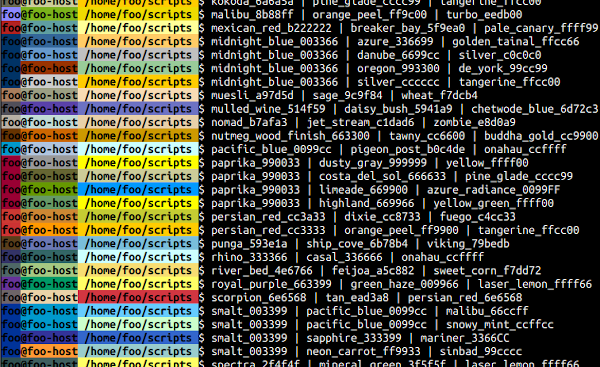

# prompt_theme_nick3499
Print different Bash background color theme per day for two months straight.



Methods used:

- random.choice()
- csv.reader()
- socket.gethostname()
- os.environ()
- os.getcwd()

This repo has been made available under the [MIT](https://opensource.org/licenses/MIT) open source license.

The `.prompt_theme.py` Python3 script was tested with:

- Linux kernel 5.4.0-14-generic
- Ubuntu 20.04 (Focal Fossa) (development branch)
- Python 3.8.2rc1 (Feb 12 2020)
- GNU Bash 5.0.11(1)-release (x86_64-pc-linux-gnu)

## .bashrc

Append the following lines to your Bash run commands file:

```shell
export TERM=xterm-256color;
export PROMPT_COMMAND='PS1="$(python3 -s /home/nick/.userpy/prompt_theme/.prompt_theme.py)"'
```

`export TERM=xterm-256color;` is mainly for `xterm` to handle 256 colors. _The value of the variable [PROMPT_COMMAND](https://www.gnu.org/software/bash/manual/html_node/Controlling-the-Prompt.html#index-prompting) is examined just before Bash prints each primary prompt._

Those exports can also be found in the `.prompt_theme.sh` dot file.

## RGB_COLORS

`RGB_COLORS` contains **color names** with their semicolon-separated **RGB values**:

```csv
{'affair_8c489f': '140;72;159', 'albescent_white_f6e7d2': '246;231;210', 'anakiwa_99ccff': '153;204;255', 'aquamarine_66ffff': '102;255;255', 'astronaut_29407c': '41;64;124', 'avocado_999967': '153;153;103', 'azure_336699': '51;102;153', 'azure_radiance_0099FF': '0;153;255', 'bahama_blue_006699': '0;102;153', 'bitter_lemon_d5d50d': '213;213;13', 'blaze_orange_ff6600': '255;102;0', 'blue_bell_9999cc': '153;153;204', 'blue_stone_006666': '0;102;102', 'bossanova_443266': '68;50;102', 'breaker_bay_5f9ea0': '95;158;160', 'brown_4d1a00': '77;26;0', 'buccaneer_663333': '102;51;51', 'buddha_gold_cc9900': '204;153;0', 'burgundy_8c001a': '140;0;26', 'camarone_005502': '0;85;2', 'cardinal_pink_6f0564': '111;5;100', 'casal_336666': '51;102;102', 'costa_del_sol_666633': '102;102;51', 'cream_ffffcc': '255;255;204', 'curious_blue_3399cc': '51;153;204', 'cyprus_004040': '0;64;64', 'danube_6699cc': '102;153;204', 'de_york_99cc99': '153;204;153', 'deep_sea_green_0a4958': '10;73;88', 'deep_teal_003333': '0;51;51', 'dodger_blue_3399ff': '51;153;255', 'dolly_ffff81': '255;255;129', 'dove_gray_666666': '102;102;102', 'dusty_gray_999999': '153;153;153', 'elm_217c7e': '33;124;126', 'finlandia_587058': '88;112;88', 'fire_9c2a00': '156;42;0', 'flush_orange_fe8402': '254;132;2', 'fun_green_009933': '0;153;51', 'gold_sand_eab988': '234;185;136', 'golden_fizz_ffff33': '255;255;51', 'golden_tainal_ffcc66': '255;204;102', 'granny_smith_apple_87e293': '135;226;147', 'green_00ff00': '0;255;0', 'green_haze_009966': '0;153;102', 'green_leaf_3a5f0b': '58;95;11', 'grenadier_c13100': '193;49;0', 'grenadier_cc3300': '204;51;0', 'guardsman_red_cc0000': '204;0;0', 'harlequin_33ff33': '51;255;51', 'highland_669966': '102;153;102', 'jet_stream_c1dad6': '193;218;214', 'kimberly_666699': '102;102;153', 'kokoda_6a6a5a': '106;106;90', 'laser_lemon_ffff66': '255;255;102', 'lemon_chiffon_fffbd0': '255;251;208', 'light_blue_669999': '102;153;153', 'limeade_669900': '102;153;0', 'lonestar_660000': '102;0;0', 'madang_afeaaa': '175;234;170', 'malibu_66ccff': '102;204;255', 'malibu_8b88ff': '139;136;255', 'mariner_3366CC': '51;102;204', 'mexican_red_b222222': '178;34;34', 'midnight_blue_003366': '0;51;102', 'midnight_blue_000066': '0;0;102', 'mineral_green_3f5f5f': '63;95;95', 'muesli_a97d5d': '169;125;93', 'navy_blue_000084': '0;0;132', 'neon_carrot_ff9933': '255;153;51', 'nomad_b7afa3': '183;175;163', 'nutmeg_wood_finish_663300': '102;51;0', 'onahau_ccffff': '204;255;255', 'orange_e64d00': '230;77;0', 'orange_peel_ff9900': '255;153;0', 'orange_peel_ff9c00': '123;179;26', 'oregon_993300': '153;51;0', 'pacific_blue_0099cc': '0;153;204', 'pale_canary_ffff99': '255;255;153', 'paprika_990033': '153;0;51', 'peach_orange_ffcc99': '255;204;153', 'periwinkle_ccccff': '204;204;255', 'periwinkle_gray_c3c3e5': '195;195;229', 'persian_green_01b6ad': '1;182;173', 'persian_red_6e6568': '210;54;65', 'persian_red_cc3333': '204;51;51', 'pigeon_post_b0c4de': '176;196;222', 'pine_glade_cccc99': '204;204;153', 'pine_glade_cccc9a': '204;204;154', 'pirate_gold_d08504': '208;133;4', 'punga_593e1a': '89;62;26', 'reef_ccffbb': '204;255;187', 'rhino_333366': '51;51;102', 'rodeo_dust_cdb99c': '205;185;156', 'royal_purple_663399': '102;51;153', 'sage_9c9f84': '156;159;132', 'sapphire_333399': '51;51;153', 'scarlet_ff2400': '255;36;0', 'school_bus_yellow_ffd800': '255;216;0', 'school_bus_yellow_ffde00': '255;222;0', 'scorpion_6e6568': '110;101;104', 'ship_cove_6b78b4': '107;120;180', 'silver_cccccc': '204;204;204', 'silver_c0c0c0': '192;192;192', 'sinbad_99cccc': '153;204;204', 'smalt_003399': '0;51;153', 'snowy_mint_ccffcc': '204;255;204', 'spectra_2f4f4f': '47;79;79', 'stiletto_9a3334': '154;51;52', 'storm_gray_777B88': '119;123;136', 'straw_d6bf86': '214;191;134', 'sushi_8ca93e': '140;169;62', 'tan_ead3a8': '234;211;168', 'tangerine_ffcc00': '255;204;0', 'tawny_cc6600': '204;102;0', 'temptress_330000': '51;0;0', 'texas_f6fa9c': '246;250;156', 'titan_white_e0e6ff': '224;230;255', 'turbo_eedb00': '238;219;0', 'tyrian_purple_660033': '102;0;51', 'waikawa_gray_587498': '88;116;152', 'viking_79bedb': '121;190;219', 'violet_660099': '102;0;153', 'wheat_f7dcb4': '247;220;180', 'yellow_ffff00': '255;255;0', 'yellow_green_ffff00': '255;255;0', 'yuma_d0ca9c': '208;202;156', 'zombie_e8d0a9': '232;208;169'}
```

## RGB_THEMES

`RGB_THEMES` contains three-color **theme names**:

```csv
{1: ['anakiwa_99ccff', 'de_york_99cc99', 'tangerine_ffcc00'], 2: ['astronaut_29407c', 'lonestar_660000', 'pirate_gold_d08504'], 3: ['azure_336699', 'dove_gray_666666', 'dusty_gray_999999'], 4: ['bahama_blue_006699', 'pacific_blue_0099cc', 'dolly_ffff81'], 5: ['blue_bell_9999cc', 'de_york_99cc99', 'cream_ffffcc'], 6: ['blue_stone_006666', 'buddha_gold_cc9900', 'school_bus_yellow_ffde00'], 7: ['bossanova_443266', 'affair_8c489f', 'periwinkle_gray_c3c3e5'], 8: ['brown_4d1a00', 'oregon_993300', 'orange_e64d00'], 9: ['buccaneer_663333', 'grenadier_cc3300', 'peach_orange_ffcc99'], 10: ['burgundy_8c001a', 'sushi_8ca93e', 'texas_f6fa9c'], 11: ['camarone_005502', 'green_leaf_3a5f0b', 'reef_ccffbb'], 12: ['cardinal_pink_6f0564', 'sushi_8ca93e', 'texas_f6fa9c'], 13: ['cyprus_004040', 'green_00ff00', 'yuma_d0ca9c'], 14: ['deep_sea_green_0a4958', 'persian_green_01b6ad', 'albescent_white_f6e7d2'], 15: ['deep_teal_003333', 'light_blue_669999', 'dusty_gray_999999'], 16: ['deep_teal_003333', 'kimberly_666699', 'pine_glade_cccc99'], 17: ['dove_gray_666666', 'avocado_999967', 'pine_glade_cccc9a'], 18: ['fire_9c2a00', 'straw_d6bf86', 'lemon_chiffon_fffbd0'], 19: ['fun_green_009933', 'blaze_orange_ff6600', 'laser_lemon_ffff66'], 20: ['finlandia_587058', 'waikawa_gray_587498', 'school_bus_yellow_ffd800'], 21: ['flush_orange_fe8402', 'granny_smith_apple_87e293', 'madang_afeaaa'], 22: ['grenadier_c13100', 'tawny_cc6600', 'orange_peel_ff9900'], 23: ['harlequin_33ff33', 'aquamarine_66ffff', 'golden_fizz_ffff33'], 24: ['kimberly_666699', 'silver_cccccc', 'tangerine_ffcc00'], 25: ['kokoda_6a6a5a', 'pine_glade_cccc99', 'tangerine_ffcc00'], 26: ['malibu_8b88ff', 'orange_peel_ff9c00', 'turbo_eedb00'], 27: ['mexican_red_b222222', 'breaker_bay_5f9ea0', 'pale_canary_ffff99'], 28: ['midnight_blue_003366', 'azure_336699', 'golden_tainal_ffcc66'], 29: ['midnight_blue_003366', 'danube_6699cc', 'silver_c0c0c0'], 30: ['midnight_blue_003366', 'oregon_993300', 'de_york_99cc99'], 31: ['midnight_blue_000066', 'periwinkle_ccccff', 'cream_ffffcc'], 32: ['midnight_blue_003366', 'silver_cccccc', 'tangerine_ffcc00'], 33: ['muesli_a97d5d', 'sage_9c9f84', 'wheat_f7dcb4'], 34: ['navy_blue_000084', 'scarlet_ff2400', 'tangerine_ffcc00'], 35: ['nomad_b7afa3', 'jet_stream_c1dad6', 'zombie_e8d0a9'], 36: ['nutmeg_wood_finish_663300', 'tawny_cc6600', 'buddha_gold_cc9900'], 37: ['pacific_blue_0099cc', 'pigeon_post_b0c4de', 'onahau_ccffff'], 38: ['paprika_990033', 'dusty_gray_999999', 'yellow_ffff00'], 39: ['paprika_990033', 'costa_del_sol_666633', 'pine_glade_cccc99'], 40: ['paprika_990033', 'limeade_669900', 'azure_radiance_0099FF'], 41: ['paprika_990033', 'highland_669966', 'yellow_green_ffff00'], 42: ['persian_red_cc3333', 'orange_peel_ff9900', 'tangerine_ffcc00'], 43: ['punga_593e1a', 'ship_cove_6b78b4', 'viking_79bedb'], 44: ['rhino_333366', 'casal_336666', 'onahau_ccffff'], 45: ['royal_purple_663399', 'green_haze_009966', 'laser_lemon_ffff66'], 46: ['scorpion_6e6568', 'tan_ead3a8', 'persian_red_6e6568'], 47: ['smalt_003399', 'pacific_blue_0099cc', 'malibu_66ccff'], 48: ['smalt_003399', 'pacific_blue_0099cc', 'snowy_mint_ccffcc'], 49: ['smalt_003399', 'sapphire_333399', 'mariner_3366CC'], 50: ['smalt_003399', 'sinbad_99cccc', 'neon_carrot_ff9933'], 51: ['spectra_2f4f4f', 'mineral_green_3f5f5f', 'laser_lemon_ffff66'], 52: ['stiletto_9a3334', 'elm_217c7e', 'dodger_blue_3399ff'], 53: ['temptress_330000', 'curious_blue_3399cc', 'rodeo_dust_cdb99c'], 54: ['tyrian_purple_660033', 'storm_gray_777B88', 'titan_white_e0e6ff'], 55: ['tawny_cc6600', 'bitter_lemon_d5d50d', 'gold_sand_eab988'], 56: ['violet_660099', 'guardsman_red_cc0000', 'blaze_orange_ff6600']}
```

## prompt_theme()

`prompt_theme()` method opens `colors.csv` and `themes.csv`. Then creates CSV readers with them, which are iterated through to generate both `RGB_COLORS` and `RGB_THEMES` dictionaries.

## rand_num

`rand_num = choice(list(RGB_THEMES.keys()))` provides a pseudo-random number for theme choice&mdash;a random theme based on enumerated values which prefix the theme records.

## rand_theme

`rand_theme = RGB_THEMES[rand_num]` assigns the three-color list of names to `rand_theme`.

## _user, _host, _dir

`_user = environ['USER']`, `_host = gethostname()` and `_dir = getcwd()` get the **username**, **hostname** and **working directory**.

## _prompt

To keep the value of `_prompt` from extending too far beyond 79 characters, it was split up into four sections:

- user
- host
- current working directory
- reset to default text format

```python
_prompt = f'\\[\\033[1;7m\\033[38;2;{RGB_COLORS[rand_theme[0]]}m\\]{_user}'
_prompt += f'\\[\\033[38;2;{RGB_COLORS[rand_theme[1]]}m\\]@{_host}'
_prompt += f'\\[\\033[38;2;{RGB_COLORS[rand_theme[2]]}m\\] {_dir} '
_prompt += f'\\[\\033[0m\\]\\$ '  # reset format to default
```

## print()

Finally, the `_prompt` is printed:

```python
print(_prompt)
```

## .print_themes.py

`.print_themes.py` displays examples of all of the color themes in the collection including color names which themes are comprised of. See screen capture above.
